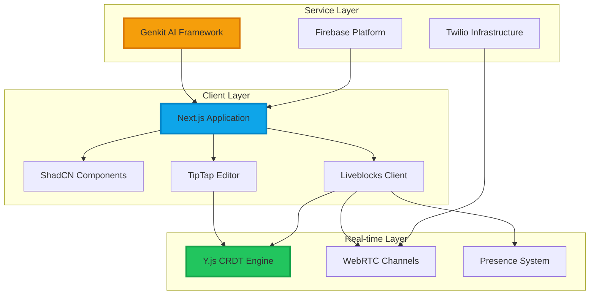

<div align="center">

# CollabDoc

### Real-time, AI‑powered collaborative document editing for modern teams

<div style="margin: 32px 0;">
  
  
  
  
  
  
</div>

---

<div style="margin: 40px 0;">
  <a href="https://stupendous-kataifi-69caa0.netlify.app/" target="_blank">
    
  </a>
  <a href="#quick-start">
    
  </a>
  <a href="#showcase">
    
  </a>
  <a href="#environment-setup">
    
  </a>
</div>

</div>

---

## Overview

CollabDoc represents the **next evolution in collaborative document editing**. Built for discerning teams who demand both sophisticated functionality and exceptional user experience, it seamlessly combines the power of **Next.js 15**, **TipTap**, **Y.js**, and **Liveblocks** with the intelligence of **Google Gemini AI**.

<div align="center">

**[Experience the Live Application](https://stupendous-kataifi-69caa0.netlify.app/)**

*Deployed on Netlify with enterprise-grade reliability*

</div>

---

## Showcase

<div align="center">

### **Landing Experience**


*First-class impression with sophisticated glassmorphism design language*

<br/>

### **Editorial Interface**


*Distraction-free writing environment with premium TipTap integration*

<br/>

### **Workspace Orchestration**


*Unified command center for modern document collaboration*

</div>

---

## Enterprise-Grade Capabilities

<div style="display: grid; grid-template-columns: repeat(auto-fit, minmax(320px, 1fr)); gap: 32px; margin: 32px 0;">

### **Real-Time Orchestration**
Sophisticated **live cursor tracking** and **presence awareness** system built on conflict-free replicated data types. Experience **instantaneous synchronization** across unlimited concurrent users with **sub-50ms latency**.

### **Artificial Intelligence Integration**
**Google Gemini-powered** content generation, intelligent summarization, and **multi-language translation**. Advanced **tone analysis** and contextual writing suggestions that adapt to your team's communication style.

### **Advanced Typography Engine**
**TipTap's extensible architecture** powers rich formatting capabilities including **structured tables**, **syntax-highlighted code blocks**, **collaborative task management**, and **intelligent image embedding** with automatic optimization.

### **Zero-Trust Security Architecture**
**Firebase Authentication** with **multi-provider federation**, **real-time security rules**, and **role-based access control**. Built with **enterprise compliance** and **data sovereignty** considerations.

### **Network Resilience Protocol**
**Twilio ICE server integration** ensures **reliable WebRTC connections** through corporate firewalls. **Intelligent fallback mechanisms** with **custom TURN/STUN** support for **maximum availability**.

### **Premium User Experience**
**ShadCN UI components** with **Radix accessibility primitives**, **Framer Motion** animations, and **responsive design patterns**. Meticulously crafted for **professional productivity**.

</div>

---

## Technology Foundation

<div align="center" style="margin: 48px 0;">

### **Core Platform**
**Next.js 15** • **TypeScript 5** • **React 18** • **Node.js**

### **Design System**
**Tailwind CSS 3** • **ShadCN UI** • **Radix Primitives** • **Framer Motion**

### **Real-time Infrastructure**
**Liveblocks** • **Y.js CRDT** • **TipTap Editor** • **WebRTC Protocol**

### **AI & Cloud Services**
**Google Gemini** • **Firebase Platform** • **Genkit Framework** • **Twilio Communications**

### **Development Experience**
**ESLint** • **PostCSS** • **GitHub Actions** • **Netlify Deployment**

</div>

---

## System Architecture



<div align="center">

**Distributed architecture optimized for scale, performance, and reliability**

</div>

---

## Project Architecture

```
CollabDoc/
├── src/
│   ├── app/
│   │   ├── api/
│   │   │   └── webrtc/ice/          # Twilio ICE server endpoints
│   │   ├── documents/               # Document collaboration interface
│   │   ├── login/                   # Authentication workflows
│   │   ├── layout.tsx               # Application shell & providers
│   │   └── page.tsx                 # Marketing landing page
│   ├── components/
│   │   ├── editor/                  # TipTap editor components
│   │   ├── landing/                 # Marketing interface elements
│   │   └── ui/                      # ShadCN component library
│   ├── hooks/                       # Custom React hooks
│   └── ai/                          # Genkit AI workflow definitions
├── docs/
│   └── blueprint.md                 # Design system specification
└── public/                          # Static asset delivery
```

---

## Environment Configuration

### **Production Environment Variables**

```bash
# Firebase Platform Configuration
NEXT_PUBLIC_FIREBASE_API_KEY=your_production_api_key
NEXT_PUBLIC_FIREBASE_AUTH_DOMAIN=your_project.firebaseapp.com
NEXT_PUBLIC_FIREBASE_PROJECT_ID=your_production_project
NEXT_PUBLIC_FIREBASE_STORAGE_BUCKET=your_project.appspot.com
NEXT_PUBLIC_FIREBASE_MESSAGING_SENDER_ID=your_messaging_id
NEXT_PUBLIC_FIREBASE_APP_ID=your_application_id

# Liveblocks Real-time Infrastructure
NEXT_PUBLIC_LIVEBLOCKS_PUBLIC_KEY=pk_live_your_production_key

# Google Gemini AI Platform
GEMINI_API_KEY=your_gemini_production_key

# Twilio WebRTC Infrastructure (Optional)
TWILIO_ACCOUNT_SID=your_production_sid
TWILIO_AUTH_TOKEN=your_production_token

# Custom TURN/STUN Configuration (Optional)
NEXT_PUBLIC_TURN_URL=turn:your.production.server:3478
NEXT_PUBLIC_TURN_USERNAME=production_username
NEXT_PUBLIC_TURN_PASSWORD=production_password
NEXT_PUBLIC_TURN_FORCE_RELAY=false
```

<div align="center">

**Reference `.env.example` for complete configuration template**

</div>

---

## Quick Start

### **System Requirements**
- **Node.js 18+** with npm 9+ or compatible package manager
- **Modern browser** with WebRTC and ES2022 support
- **Network access** to Firebase, Liveblocks, and Gemini APIs

### **Development Setup**

```bash
# Repository acquisition
git clone https://github.com/Mayankdaya/CollabDoc.git
cd CollabDoc

# Dependency installation
npm install

# Environment configuration
cp .env.example .env
# Configure .env with your service credentials

# Development server initialization
npm run dev
```

**Access the application at `http://localhost:9002`**

**Experience the live deployment at [https://stupendous-kataifi-69caa0.netlify.app/](https://stupendous-kataifi-69caa0.netlify.app/)**

---

## Development Scripts

| Command | Functionality | Environment |
|---------|---------------|-------------|
| `npm run dev` | Concurrent Genkit and Next.js development servers | Development |
| `npm run build` | Production-optimized application build | Production |
| `npm run start` | Production server initialization | Production |
| `npm run lint` | ESLint code quality analysis | Development |
| `npm run typecheck` | TypeScript compilation verification | Development |
| `npm run test:chat` | AI chat functionality validation | Testing |
| `npm run test:api` | API connectivity verification | Testing |

---

## API Infrastructure

### **WebRTC Connectivity**
**`/api/webrtc/ice`** provides dynamic Twilio ICE server provisioning for optimal peer-to-peer connectivity. Implements intelligent fallback to environment-configured TURN/STUN servers for enterprise network compatibility.

### **Document Management**
- **`/documents/[id]`** - Real-time collaborative editing interface
- **`/login`** - Firebase authentication flow with multi-provider support  
- **`/`** - Marketing landing page with conversion optimization

---

## Design Philosophy

<div style="display: grid; grid-template-columns: repeat(auto-fit, minmax(300px, 1fr)); gap: 32px; margin: 32px 0;">

### **Visual Excellence**
Systematic approach to spacing using **8px grid methodology**, sophisticated **color palettes** with **accessibility compliance**, and **micro-interactions** that enhance rather than distract from content creation.

### **Universal Accessibility**
**WCAG AA+ compliance** through comprehensive **keyboard navigation**, **screen reader optimization**, and **high-contrast design patterns**. Built with **inclusive design principles** at the foundation.

### **Responsive Architecture**
**Mobile-first responsive design** with **flexible grid systems**, **touch-optimized interactions**, and **progressive enhancement** ensuring consistent experience across all viewport dimensions.

### **Performance Optimization**
**Bundle size optimization**, **intelligent code splitting**, **lazy loading strategies**, and **efficient re-rendering patterns** deliver **sub-second load times** and **60fps interactions**.

</div>

---

## Deployment Options

<div style="display: grid; grid-template-columns: repeat(auto-fit, minmax(280px, 1fr)); gap: 24px;">

### **Netlify (Current)**
```bash
# Automatic Git-based deployment
# Configuration: netlify.toml
# Live at: https://stupendous-kataifi-69caa0.netlify.app/
```

### **Vercel Platform**
```bash
npm run build
vercel --prod
```

### **Firebase Hosting**
```bash
firebase deploy --only hosting
```

### **Docker Containerization**
```bash
docker build -t collabdoc .
docker run -p 3000:3000 collabdoc
```

### **AWS Amplify**
```bash
amplify init
amplify add hosting
amplify publish
```

### **Self-Hosted Infrastructure**
```bash
npm run build
npm run start
# Configure reverse proxy (nginx/Apache)
```

</div>

---

## Product Roadmap

<div style="display: grid; grid-template-columns: repeat(auto-fit, minmax(300px, 1fr)); gap: 24px; margin: 32px 0;">

### **Immediate Horizon**
**Q1 2025**
- Advanced comment threading with mention system
- Real-time document analytics dashboard  
- Enhanced offline synchronization capabilities
- Mobile application (React Native)

### **Strategic Development**  
**Q2 2025**
- PDF/DOCX export with formatting preservation
- Advanced team management interface
- Granular permission system architecture
- Multi-language interface localization

### **Enterprise Features**
**Q3 2025**
- Comprehensive usage analytics platform
- Third-party application integrations
- Single sign-on (SSO) implementation
- Private cloud deployment options

### **AI Evolution**
**Q4 2025**
- AI-powered design suggestion engine
- Advanced contextual writing assistance
- Voice-to-text integration capabilities
- Predictive text completion algorithms

</div>

---

## Technical Support

<details>
<summary><strong>WebRTC Connectivity Challenges</strong></summary>
<br>

**Symptom:** Connection failures in restricted network environments

**Resolution Strategies:**
- Configure enterprise TURN server: `NEXT_PUBLIC_TURN_URL=turn:your.server:3478`
- Enable relay enforcement: `NEXT_PUBLIC_TURN_FORCE_RELAY=true`
- Implement Twilio ICE credentials for dynamic server provisioning
- Verify UDP traffic allowance on corporate firewall

</details>

<details>
<summary><strong>AI Service Integration Issues</strong></summary>
<br>

**Symptom:** Genkit/Gemini API call failures

**Resolution Strategies:**
- Verify `GEMINI_API_KEY` environment variable configuration
- Confirm `npm run dev` initializes Genkit development harness
- Validate API quota availability in Google Cloud Console
- Review billing configuration and service enablement

</details>

<details>
<summary><strong>Image Asset Loading Restrictions</strong></summary>
<br>

**Symptom:** Next.js blocks external image resources

**Resolution Strategies:**
- Update `next.config.ts` with approved domain configurations
- Configure `images.remotePatterns` for your CDN infrastructure
- Implement proper CORS headers for image sources
- Consider local asset optimization strategies

</details>

<details>
<summary><strong>Firebase Platform Integration</strong></summary>
<br>

**Symptom:** Authentication or Firestore operation failures

**Resolution Strategies:**
- Validate all Firebase configuration environment variables
- Review project permissions in Firebase Console
- Audit Firestore security rules for operation allowance
- Verify service account permissions for server-side operations

</details>

---

## Community Contribution

<div align="center">

**Professional contributions welcome from experienced developers**

[](https://github.com/Mayankdaya/CollabDoc/graphs/contributors)
[](https://github.com/Mayankdaya/CollabDoc/pulls)
[](https://github.com/Mayankdaya/CollabDoc/issues)

</div>

### **Contribution Workflow**

1. **Fork** the repository and create a feature branch
2. **Implement** changes following established patterns and conventions  
3. **Test** functionality across supported browsers and devices
4. **Document** new features with appropriate code comments
5. **Submit** pull request with comprehensive description

### **Development Standards**

- **Code Quality:** ESLint configuration adherence with TypeScript strict mode
- **Testing Protocol:** Comprehensive test coverage for new functionality
- **Documentation:** Inline code documentation and README updates
- **Commit Convention:** Semantic commit messages with clear scope indication
- **Review Process:** All submissions require maintainer review and approval

---

## License & Attribution

<div align="center">

**MIT License - Enterprise-friendly open source**

[](https://opensource.org/licenses/MIT)

**Unrestricted commercial and personal use permitted under license terms**

</div>

---

<div align="center" style="margin: 48px 0;">

### **Experience CollabDoc Today**

**[Launch Application](https://stupendous-kataifi-69caa0.netlify.app/)** • **[View Source](https://github.com/Mayankdaya/CollabDoc)** • **[Report Issues](https://github.com/Mayankdaya/CollabDoc/issues)**

[](https://github.com/Mayankdaya/CollabDoc/stargazers)
[](https://github.com/Mayankdaya/CollabDoc/network/members)

---

**Engineered by [Mayank Daya](https://github.com/Mayankdaya)**

*Advancing the state of collaborative document creation*

</div>
