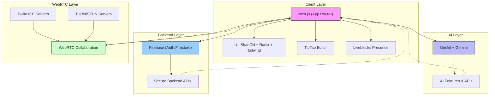

<div align="center">

# CollabDoc ✨

Real-time, AI‑powered collaborative document editing for modern teams.

[](https://nextjs.org/)
[](https://www.typescriptlang.org/)
[](https://tailwindcss.com/)
[](https://firebase.google.com/)
[](https://github.com/googleapis/genkit)
[](https://liveblocks.io/)
[](https://www.twilio.com/)

</div>

---

<div align="center">

<a href="#getting-started"></a>
<a href="#showcase"></a>
<a href="#environment-variables"></a>

</div>

## Overview

CollabDoc is a modern, enterprise‑grade collaborative editor built with Next.js App Router, TipTap, Y.js, and Liveblocks for real‑time presence and sync. It’s supercharged with Genkit + Google Gemini for assisted writing, summarization, and translation. Optional Twilio ICE integration improves WebRTC reliability behind strict networks. Designed with ShadCN UI, Radix Primitives, and Tailwind, it delivers a delightful, responsive experience.

> Demo: Coming soon. You can run locally via `npm run dev` and open http://localhost:9002

## Showcase

Place the following images under `public/readme/` and they will render below on GitHub:

- `public/readme/landing-hero.png` — Landing hero section
- `public/readme/editor-dark.png` — Editor UI (dark) with toolbar
- `public/readme/editor-ai-chat.png` — AI assistant chat inside the editor

<div align="center">


<br/>
<em>Landing page — Craft Intelligence, Together.</em>

<br/><br/>


<br/>
<em>Beautiful, distraction‑free editor with TipTap and ShadCN UI.</em>

<br/><br/>


<br/>
<em>Unified Workspace</em>

</div>

> Don’t see images? Add the files with the exact names above into `public/readme/` and commit them.

## Table of Contents

- [Overview](#overview)
- [Showcase](#showcase)
- [Features](#features)
- [Tech Stack](#tech-stack)
- [Project Structure](#project-structure)
- [Environment Variables](#environment-variables)
- [Getting Started](#getting-started)
- [NPM Scripts](#npm-scripts)
- [Key Endpoints & Modules](#key-endpoints--modules)
- [Design & UX](#design--ux)
- [Deployment](#deployment)
- [Roadmap](#roadmap)
- [Troubleshooting](#troubleshooting)
- [Contributing](#contributing)
- [License](#license)

## Highlights

- ✨ Polished dark UI with subtle glassmorphism and spotlight effects.
- 🤝 Real‑time multiplayer editing with presence cursors and avatars.
- 🤖 AI assistant embedded in the editor for ideation, rewriting, and summarization.
- 🧩 Modular TipTap extensions: tables, tasks, code, highlights, alignment, and more.
- 🔐 Production‑ready auth and data using Firebase (Auth + Firestore).
- 🌐 Reliable connectivity with optional Twilio ICE or custom TURN.

## Features

- Real‑Time Collaboration: Live cursors, selections, and conflict‑free editing with Y.js and Liveblocks.
- Rich Text Editing: TipTap‑based editor with tables, images, lists, headings, code, highlights, tasks, text align, underline, and more.
- AI‑Assisted Writing: Summarize, translate, and generate content using Genkit + Gemini.
- Presence & Comments: Presence via Liveblocks; commenting components ready to extend.
- Secure Auth & Storage: Firebase Auth + Firestore (configurable).
- Connectivity Options: Optional Twilio ICE servers endpoint for WebRTC.
- Production‑Ready UI: ShadCN UI, Radix, Tailwind, typography, and thoughtful animations.

## Tech Stack

- Framework: Next.js 15 (App Router) with TypeScript
- Editor: TipTap 2 (+ extensions) and Y.js
- Realtime/Presence: Liveblocks (`@liveblocks/*`)
- AI: Genkit + Google Gemini (`@genkit-ai/googleai`, `genkit`)
- Auth/DB: Firebase (Auth, Firestore), `firebase-admin`
- WebRTC: Optional Twilio Token API for ICE servers
- UI/UX: Tailwind CSS, ShadCN UI, Radix UI, Lucide, Framer Motion

### 🛠️ Technology Stack

<div align="center">

#### **Core Technologies**
<p align="center">
  
  
  
  
  
  
  
  
  
  
  
</p>

#### **Realtime & Collaboration**
<p align="center">
  
  
  
  
  
</p>

#### **UI/UX & Design**
<p align="center">

  
  
  
  
</p>

#### **Developer Tools**
<p align="center">
  
  
  
  
  
  
  
</p>

#### **AI/ML**
<p align="center">
  
  
  
  
  
</p>

</div>

# Architecture Overview



## Architecture Components

### Client Layer
- **Next.js (App Router)**: Modern React framework with server-side rendering capabilities
- **UI Components**: 
  - ShadCN UI - Reusable component library
  - Radix UI - Primitive component foundation
  - Tailwind CSS - Utility-first CSS framework
- **Real-time Editors**:
  - TipTap Editor - Rich text editor framework
  - Liveblocks Presence - Real-time collaboration features

### AI Layer
- **Genkit + Gemini**: Google's AI development framework with Gemini models
- **AI Features**: Custom implementations for AI-powered functionality

### Backend Layer
- **Firebase**:
  - Authentication - User management and security
  - Firestore - NoSQL database for real-time data
- **Secure APIs**: Custom backend APIs with proper authentication

### WebRTC Layer
- **WebRTC Collaboration**: Peer-to-peer communication for real-time features
- **Twilio ICE Servers**: Optional dynamic STUN/TURN servers
- **TURN/STUN Servers**: Environment-configurable relay servers for NAT traversal

## Data Flow
1. Client interactions are handled through Next.js components
2. UI components render using ShadCN/Radix with Tailwind styling
3. Real-time editing features powered by TipTap and Liveblocks
4. AI features processed through Genkit with Gemini models
5. Data persistence and authentication handled by Firebase
6. Real-time communication established via WebRTC with configurable relay servers

## Environment Configuration
The architecture supports environment-specific configuration for:
- TURN/STUN server selection
- Firebase project settings
- AI model parameters
- Feature flags for optional components

## Project Structure

```
src/
  app/
    api/
      webrtc/ice/route.ts       # Twilio ICE servers endpoint
    documents/                  # App pages (documents, etc.)
    login/                      # Auth page
    page.tsx                    # Landing page
    layout.tsx                  # App layout + providers
  components/
    editor/                     # TipTap editor and UI
    landing/                    # Landing UI (navbar, hero, features)
    ui/                         # ShadCN UI components
  hooks/                        # React hooks
docs/
  blueprint.md                  # Product/Design blueprint
```

## Environment Variables

Create a `.env` file in the project root. See `.env.example` for details.

```env
# Public Firebase web config (client)
NEXT_PUBLIC_FIREBASE_API_KEY=
NEXT_PUBLIC_FIREBASE_AUTH_DOMAIN=
NEXT_PUBLIC_FIREBASE_PROJECT_ID=
NEXT_PUBLIC_FIREBASE_STORAGE_BUCKET=
NEXT_PUBLIC_FIREBASE_MESSAGING_SENDER_ID=
NEXT_PUBLIC_FIREBASE_APP_ID=

# Liveblocks public key (client)
NEXT_PUBLIC_LIVEBLOCKS_PUBLIC_KEY=

# Gemini API key (server only)
GEMINI_API_KEY=

# Optional: Twilio for WebRTC ICE (server only)
# Used by src/app/api/webrtc/ice/route.ts
TWILIO_ACCOUNT_SID=
TWILIO_AUTH_TOKEN=

# Optional TURN override (client)
NEXT_PUBLIC_TURN_URL=
NEXT_PUBLIC_TURN_USERNAME=
NEXT_PUBLIC_TURN_PASSWORD=
NEXT_PUBLIC_TURN_FORCE_RELAY=false
```

Notes:

- If `TWILIO_ACCOUNT_SID` and `TWILIO_AUTH_TOKEN` are not set, the ICE endpoint responds with an empty list so the client can fall back to your TURN/STUN envs.
- See `src/app/api/webrtc/ice/route.ts` for the implementation that fetches Twilio ICE servers.

## Getting Started

Prerequisites:

- Node.js 18+
- npm 9+ (or pnpm/yarn if preferred)

Install and run:

```bash
git clone https://github.com/Mayankdaya/CollabDoc.git
cd CollabDoc
npm install

# Create and populate .env (see above)
cp .env.example .env  # then edit values

# Start Genkit dev harness + Next.js (port 9002)
npm run dev
```

Open http://localhost:9002 in your browser.

## NPM Scripts

- dev: genkit start -- next dev -p 9002
- build: next build
- start: next start
- lint: next lint
- typecheck: tsc --noEmit
- test:chat: genkit eval:run -f src/ai/dev.ts chat-test
- test:api: genkit eval:run -f src/ai/dev.ts api-key-test

## Key Endpoints & Modules

- API: `src/app/api/webrtc/ice/route.ts`
  - Returns Twilio ICE servers if `TWILIO_ACCOUNT_SID`/`TWILIO_AUTH_TOKEN` are set.
  - Otherwise returns an empty array so clients can use env TURN/STUN.

- Landing Page: `src/app/page.tsx`
  - Marketing sections, feature highlights, testimonials, and CTA.

- Editor Components: `src/components/editor/`
  - TipTap setup and rich text features.

## Design & UX

- Based on the blueprint in `docs/blueprint.md` (color palette, typography, iconography).
- Uses ShadCN UI + Radix primitives for accessible, consistent components.
- Tailwind utilities + custom effects (Spotlight, glow) for polish.

## Premium Design Principles

- Consistent spacing, typography scale, and motion curves for a refined feel.
- Subtle depth via shadows and translucency, never distracting from content.
- High-contrast accessible color choices; meets WCAG AA where feasible.
- Keyboard‑first interaction and ARIA attributes via Radix primitives.

## Deployment

- Next.js standard build: `npm run build && npm start`.
- Netlify config present: `netlify.toml` (optional).
- App Hosting: `apphosting.yaml` (optional for your platform).

Ensure environment variables are set in your hosting provider. For Twilio ICE, set `TWILIO_ACCOUNT_SID` and `TWILIO_AUTH_TOKEN` as server environment variables.

## Roadmap

- Comment threads with mentions and notifications.
- Document export to PDF/DOCX with layout fidelity.
- Offline editing and sync reconciliation.
- Role‑based access control and granular permissions.
- Expanded AI tools (tone, rewrite, outline).

## Troubleshooting

- WebRTC failing on restricted networks:
  - Provide a TURN reachable over TCP/TLS 443 via `NEXT_PUBLIC_TURN_URL`.
  - Or configure Twilio credentials for dynamic ICE via the `/api/webrtc/ice` route.

- Genkit/Gemini calls fail:
  - Verify `GEMINI_API_KEY` and that `npm run dev` is used to start the Genkit harness.

- Images blocked by Next Image:
  - See `next.config.ts` and ensure your domains are allowed (e.g., `picsum.photos`, `placehold.co`).

## Contributing

Contributions are welcome! Please fork the repository, create a feature branch, and open a pull request.

1. Fork the repo
2. Create your feature branch: `git checkout -b feat/amazing-feature`
3. Commit your changes: `git commit -m "feat: add amazing feature"`
4. Push to the branch: `git push origin feat/amazing-feature`
5. Open a PR

## License

This project is licensed under the MIT License.
